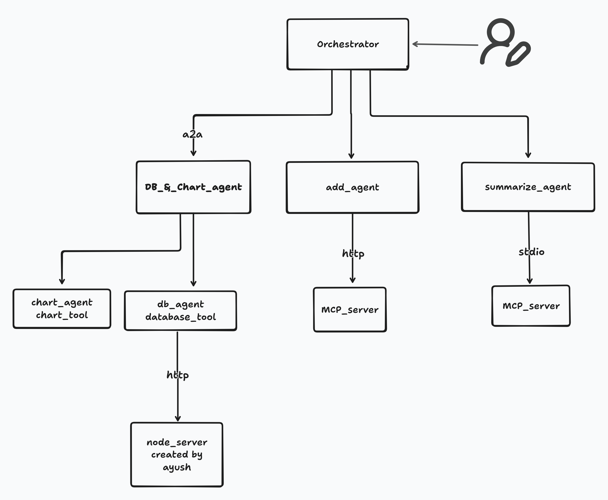

## 🧠 Orchestrator Architecture Flow

Below is the visual representation of the complete multi-agent orchestration workflow:

<p align="center">
  
</p>

### 📌 Description

This flow chart illustrates how the **Root Agent** coordinates with multiple sub-agents such as:

## 🔧 Available Sub-Agents & Capabilities

- 🗄️ **Database Agent**  
  Handles database operations such as insert, update, delete, and retrieval.

- 📈 **Chart Agent**  
  Generates visual charts and graphical insights from processed data.

- 📝 **Text / Summary Agent**  
  Produces summaries, explanations, and formatted textual responses.

- ➕ **Math Utility (Addition Tool)**  
  Performs arithmetic operations such as addition of two numbers.


The Root Agent acts as the central decision-maker and delegates tasks based on user intent.


# Scripts

Scripts to run different sections of the project
For all the commands below I recommend using different terminals, and start from the root directory.

## Database and Chart Agent - CRUD over HTTP

DB Agent is exposed on http://0.0.0.0:8001 via A2A

```bash
uvicorn DB_&_chart_agent.agent:a2a_app --host 0.0.0.0 --port 8001
```

## Summary Tool - MCP HTTP Server

File creation MCP server is exposed on http://0.0.0.0:8002 via HTTP transport
```bash
cd mcp_server
uv run adk_mcp_http.py
```
## Add Two Number tool STDIO*

Add Two Number MCP server based on standard input output transport
!Not required to run on any port since it runs over STDIO 

## Orchestrator Agent --> my-agent

Agent to orchestrate all the other agents
```bash
adk run root_agent
```
Test agents on web using adk cli, defaults at port 8000

```bash
adk web
```
---

Crafted with ♥️ by Mohit Sahu
